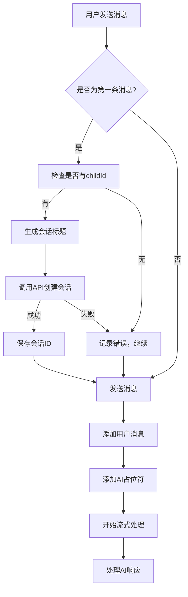

# 🆕 会话自动创建功能指南

## 📋 功能概述

当用户发送第一条消息时，系统会自动创建一个新的会话来管理对话历史。这个功能确保每次聊天都有适当的上下文管理和历史记录。

## 🎯 核心特性

### ✨ 自动创建

- **触发时机**: 用户发送第一条消息时
- **检测逻辑**: 检查 `messageManager.messages.length === 0`
- **创建条件**: 需要有效的 `childId` 参数

### 📝 智能标题

- **生成规则**: 基于第一条消息内容
- **长度限制**: 最大 20 个字符，超出部分用"..."表示
- **清理逻辑**: 自动移除末尾的标点符号

### 🔄 错误处理

- **失败策略**: 会话创建失败不阻止消息发送
- **用户体验**: 即使创建失败，聊天功能仍然正常工作
- **日志记录**: 详细的错误日志便于调试

## 🏗️ 架构设计

### 核心组件

#### 1. useChatOrchestrator Hook

```typescript
export interface ChatOrchestratorOptions {
  onMessageSent?: (message: ChatMessage) => void;
  onMessageReceived?: (message: ChatMessage) => void;
  onError?: (error: Error) => void;
  onStreamingStart?: () => void;
  onStreamingComplete?: (content: string) => void;
  onConversationCreated?: (conversationId: number) => void; // 🆕 新增
  childId?: number | null; // 🆕 新增
  conversationId?: number | null; // 🆕 新增
}
```

#### 2. 会话创建逻辑

```typescript
const createConversationIfNeeded = useCallback(
  async (firstMessage: string): Promise<number | null> => {
    // 如果已经有会话ID，直接返回
    if (currentConversationId) {
      return currentConversationId;
    }

    // 如果没有childId，无法创建会话
    if (!options.childId) {
      console.warn('⚠️ 没有childId，无法创建会话');
      return null;
    }

    try {
      // 生成会话标题
      const title = generateConversationTitle(firstMessage);

      // 创建会话
      const newConversation = await conversationStore.createConversation(
        options.childId,
        title,
      );

      const newConversationId = newConversation.id;
      setCurrentConversationId(newConversationId);

      // 通知会话创建完成
      options.onConversationCreated?.(newConversationId);

      return newConversationId;
    } catch (error) {
      console.error('❌ 创建会话失败:', error);
      // 会话创建失败不应该阻止消息发送
      return null;
    }
  },
  [
    currentConversationId,
    options.childId,
    options.onConversationCreated,
    conversationStore,
  ],
);
```

#### 3. 发送消息流程集成

```typescript
const sendMessage = useCallback(
  async (content: string, sendFunction: Function) => {
    try {
      // ... 其他逻辑

      // 🆕 检查是否需要创建会话（第一条消息时）
      const isFirstMessage = messageManager.messages.length === 0;
      if (isFirstMessage) {
        console.debug('🆕 检测到第一条消息，尝试创建会话');
        const conversationId = await createConversationIfNeeded(content);

        if (conversationId) {
          console.debug('🗂️ 会话创建完成，继续发送消息:', { conversationId });
        } else {
          console.debug('🗂️ 会话创建失败或跳过，继续发送消息');
        }
      }

      // ... 继续消息发送流程
    } catch (error) {
      // ... 错误处理
    }
  },
  [streamProcessor, messageManager, options, createConversationIfNeeded],
);
```

## 🔧 使用方法

### 在 ChatContainer 中配置

```typescript
const chatOrchestrator = useChatOrchestrator({
  childId: childId || null, // 🆕 传递 childId
  conversationId: initialConversationId || null, // 🆕 传递现有会话ID
  onConversationCreated: (conversationId) => {
    console.log('🆕 会话创建成功:', conversationId);
    // 这里可以添加会话创建后的处理逻辑
    // 比如更新URL、通知父组件等
  },
  // ... 其他回调
});
```

### API 集成

会话创建使用现有的 `useConversationStore` Hook：

```typescript
const conversationStore = useConversationStore();

// 创建会话
const newConversation = await conversationStore.createConversation(
  childId,
  title,
);
```

## 📊 工作流程

### 完整的消息发送流程



### 状态管理

```typescript
// 会话状态
const [currentConversationId, setCurrentConversationId] = useState<
  number | null
>(options.conversationId || null);

// 会话创建逻辑
if (isFirstMessage && !currentConversationId && options.childId) {
  const newConversationId = await createConversation();
  setCurrentConversationId(newConversationId);
}
```

## 🧪 测试验证

### 测试场景

1. **第一条消息**: 自动创建会话
2. **后续消息**: 复用现有会话
3. **清空重新开始**: 创建新会话
4. **错误处理**: 创建失败不影响聊天
5. **标题生成**: 正确处理各种消息格式

### 预期日志

```
🆕 检测到第一条消息，尝试创建会话
🆕 创建新会话: { childId: 123, firstMessage: "宝宝发烧怎么办？" }
📝 模拟创建会话: { childId: 123, title: "宝宝发烧怎么办" }
✅ 会话创建成功: { conversationId: 359, title: "宝宝发烧怎么办" }
🗂️ 会话创建完成，继续发送消息: { conversationId: 359 }
```

## 🎨 用户体验

### 优势

1. **无感知创建**: 用户无需手动创建会话
2. **智能标题**: 自动生成有意义的会话标题
3. **容错性强**: 创建失败不影响聊天功能
4. **历史管理**: 自动组织对话历史

### 边界情况处理

1. **无 childId**: 跳过会话创建，但聊天功能正常
2. **网络错误**: 记录错误，继续发送消息
3. **重复创建**: 检查现有会话 ID，避免重复创建
4. **长标题**: 自动截断并添加省略号

## 📈 性能考虑

### 优化策略

1. **异步创建**: 会话创建不阻塞消息发送
2. **错误隔离**: 创建失败不影响核心聊天功能
3. **状态缓存**: 避免重复创建会话
4. **日志优化**: 生产环境可调整日志级别

### 资源管理

- **内存**: 合理管理会话状态
- **网络**: 避免不必要的 API 调用
- **存储**: 利用现有的会话存储机制

## 🔮 未来扩展

### 可能的增强功能

1. **会话分类**: 根据消息类型自动分类
2. **智能合并**: 相似主题的会话智能合并
3. **标题优化**: 使用 AI 生成更智能的标题
4. **批量操作**: 支持批量会话管理

### API 扩展

```typescript
// 未来可能的扩展
interface ConversationCreationOptions {
  autoTitle?: boolean;
  category?: string;
  tags?: string[];
  priority?: number;
}
```

## 📚 相关文档

- [会话管理 Hook 文档](./src/pages/chat/hooks/useConversationStore.ts)
- [聊天编排器文档](./src/pages/chat/hooks/core/useChatOrchestrator.ts)
- [API 接口文档](./src/api/chat.ts)
- [类型定义文档](./src/types/models.ts)

## 🎯 总结

会话自动创建功能通过以下方式提升了用户体验：

- ✅ **自动化**: 无需手动创建会话
- ✅ **智能化**: 自动生成有意义的标题
- ✅ **健壮性**: 错误处理不影响核心功能
- ✅ **一致性**: 与现有架构完美集成
- ✅ **可扩展**: 为未来功能预留接口

这个功能确保了每次聊天都有适当的上下文管理，为用户提供了更好的对话历史组织和管理体验。
