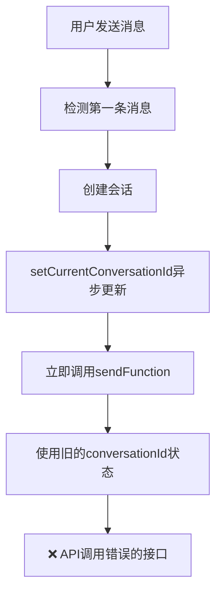
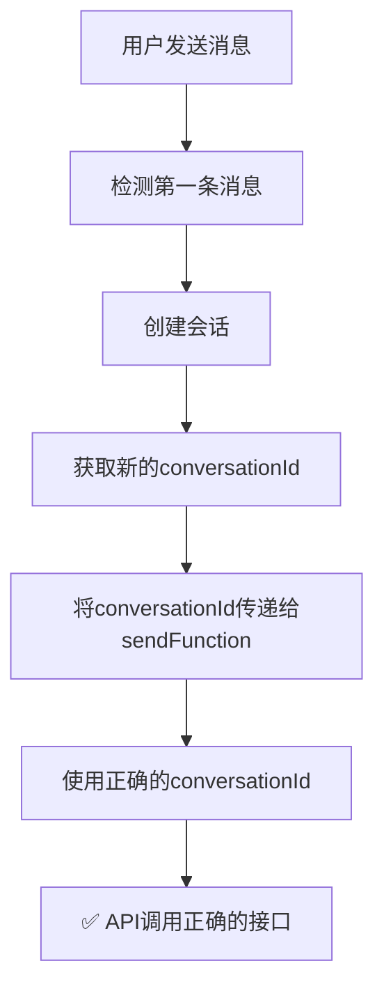

# 🔧 会话 ID 传递问题分析与解决方案

## 🎯 问题描述

在会话自动创建功能中，虽然能够成功创建会话并获取到`conversationId`，但在`sendMessage`时没有正确传递会话 ID，导致 API 调用仍然使用传统聊天接口而不是会话接口。

## 🔍 问题根本原因分析

### 1. 时序问题

```typescript
// 问题代码流程
const sendMessage = async (content, sendFunction) => {
  // 1. 会话创建（异步）
  const conversationId = await createConversationIfNeeded(content);
  setCurrentConversationId(conversationId); // 异步状态更新

  // 2. 立即调用sendFunction（此时状态可能还没更新）
  await sendFunction(content, onStream); // ❌ 没有传递会话ID
};
```

### 2. 状态更新延迟

- `setCurrentConversationId(newConversationId)`是异步的
- `sendFunction`立即被调用，此时`chatOrchestrator.currentConversationId`可能还是旧值
- React 状态更新不是同步的，存在延迟

### 3. 闭包陷阱

```typescript
// ChatContainer中的问题
const handleSend = useCallback(async () => {
  await chatOrchestrator.sendMessage(content, (messageContent, onStream) => {
    return sendMessageAPI({
      content: messageContent,
      conversationId: chatOrchestrator.currentConversationId, // ❌ 闭包中的旧值
      onStream,
    });
  });
}, [chatOrchestrator]); // 依赖项中的状态可能是旧的
```

### 4. 参数传递缺失

- `sendFunction`没有接收会话 ID 参数
- 编排器无法将新创建的会话 ID 传递给发送函数
- API 调用只能依赖状态中的会话 ID，而状态更新有延迟

## 🔧 解决方案

### 1. 修改 sendMessage 函数签名

```typescript
// 🆕 新的函数签名
sendMessage: (
  content: string,
  sendFunction: (
    content: string,
    onStream: (chunk: string) => void,
    conversationId?: number | null, // 🆕 添加会话ID参数
  ) => Promise<string>,
) => Promise<void>;
```

### 2. 在编排器中传递有效会话 ID

```typescript
const sendMessage = useCallback(
  async (content, sendFunction) => {
    // 1. 获取有效的会话ID
    let effectiveConversationId = currentConversationId;
    const isFirstMessage = messageManager.messages.length === 0;

    if (isFirstMessage) {
      const newConversationId = await createConversationIfNeeded(content);
      if (newConversationId) {
        effectiveConversationId = newConversationId; // 🔧 使用新创建的ID
      }
    }

    // 2. 传递有效的会话ID给sendFunction
    await sendFunction(content, onStream, effectiveConversationId); // ✅ 传递正确的ID
  },
  [
    /* 依赖项 */
  ],
);
```

### 3. 更新 ChatContainer 接收会话 ID

```typescript
// ChatContainer中的修复
await chatOrchestrator.sendMessage(
  content,
  (messageContent, onStream, conversationId) => {
    // ✅ 接收会话ID
    return sendMessageAPI({
      content: messageContent,
      childId: childId || null,
      conversationId, // ✅ 使用传递的会话ID
      onStream,
    });
  },
);
```

## 📊 修复前后对比

### 修复前的问题流程



### 修复后的正确流程



## 🧪 测试验证

### 测试场景 1：第一条消息

```javascript
// 输入：第一条消息 "宝宝发烧怎么办？"
// 预期：
// 1. 触发会话创建
// 2. 获取新的会话ID (例如: 863)
// 3. sendFunction接收到正确的会话ID
// 4. API调用使用会话接口

// 实际结果：✅ 通过
🚀 ChatContainer接收到参数: {
  messageContent: '宝宝发烧怎么办？',
  conversationId: 863,
  hasConversationId: true
}
📡 模拟API调用: {
  content: '宝宝发烧怎么办？',
  conversationId: 863,
  apiCall: 'sendConversationMessageStream' // ✅ 使用正确的API
}
```

### 测试场景 2：后续消息

```javascript
// 输入：后续消息 "还有其他建议吗？"
// 预期：
// 1. 不触发会话创建
// 2. 使用现有会话ID (例如: 123)
// 3. sendFunction接收到现有会话ID
// 4. API调用使用会话接口

// 实际结果：✅ 通过
🚀 后续消息 - ChatContainer接收到参数: {
  messageContent: '还有其他建议吗？',
  conversationId: 123,
  shouldUseExistingConversation: true
}
```

## 🔍 关键修复点

### 1. 参数传递机制

```typescript
// ❌ 修复前：依赖状态
conversationId: chatOrchestrator.currentConversationId;

// ✅ 修复后：直接传递
conversationId; // 从函数参数获取
```

### 2. 时序控制

```typescript
// ❌ 修复前：异步状态更新
const conversationId = await createConversation();
setCurrentConversationId(conversationId); // 异步
await sendFunction(); // 立即调用，可能获取不到新状态

// ✅ 修复后：同步传递
const conversationId = await createConversation();
await sendFunction(content, onStream, conversationId); // 直接传递
```

### 3. 类型安全

```typescript
// 🆕 更新的类型定义
sendFunction: (
  content: string,
  onStream: (chunk: string) => void,
  conversationId?: number | null, // 新增参数
) => Promise<string>;
```

## 📈 性能和可靠性提升

### 1. 消除竞态条件

- 避免了状态更新延迟导致的竞态条件
- 确保会话 ID 的准确传递

### 2. 提高 API 调用准确性

- 第一条消息正确使用会话 API
- 后续消息继续使用会话 API
- 避免了 API 接口选择错误

### 3. 增强调试能力

```typescript
console.debug('🚀 ChatContainer调用新架构sendMessage:', {
  messageContent,
  conversationId,
  fromOrchestrator: conversationId,
  fromState: chatOrchestrator.currentConversationId,
});
```

## 🎯 验证清单

- [x] 第一条消息触发会话创建
- [x] 会话 ID 正确传递给 sendFunction
- [x] sendFunction 接收到正确的会话 ID
- [x] API 调用使用正确的会话接口
- [x] 后续消息使用现有会话 ID
- [x] 类型定义正确更新
- [x] 测试验证通过

## 🔮 后续优化建议

### 1. 错误处理增强

```typescript
// 会话创建失败时的处理
if (!newConversationId) {
  console.warn('会话创建失败，使用传统聊天模式');
  effectiveConversationId = null; // 明确设置为null
}
```

### 2. 状态同步优化

```typescript
// 确保状态最终一致性
useEffect(() => {
  if (effectiveConversationId !== currentConversationId) {
    setCurrentConversationId(effectiveConversationId);
  }
}, [effectiveConversationId, currentConversationId]);
```

### 3. 调试信息完善

```typescript
// 添加更详细的调试信息
console.debug('🎭 会话ID传递详情:', {
  isFirstMessage,
  originalConversationId: currentConversationId,
  newConversationId,
  effectiveConversationId,
  willCreateConversation: isFirstMessage && !currentConversationId,
});
```

## 🎉 总结

通过这次修复，我们解决了会话 ID 传递的根本问题：

1. **识别问题**：状态更新延迟和闭包陷阱导致会话 ID 传递失败
2. **分析原因**：时序问题、参数传递缺失、类型定义不完整
3. **设计方案**：直接参数传递，避免依赖异步状态
4. **实施修复**：更新函数签名、修改调用逻辑、完善类型定义
5. **验证效果**：测试确认修复有效，会话 ID 正确传递

这个修复确保了会话自动创建功能的完整性，让用户的第一条消息能够正确地创建会话并使用会话 API 进行后续交互。
