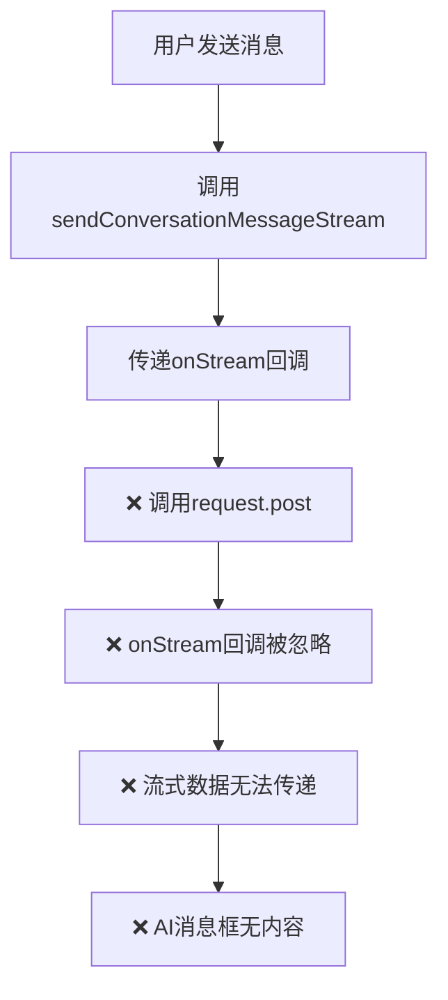
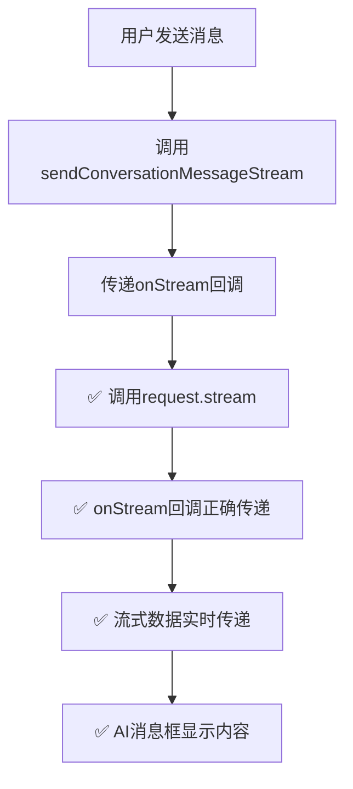

# 🌊 流式响应问题分析与解决方案总结

## 🎯 问题描述

在会话自动创建功能中，虽然接口成功返回了 OpenAI 兼容的流式响应数据，但 AI 消息框没有显示内容。初步怀疑`sendFunction`没有被正确触发，导致流式数据无法传递到 UI 组件。

## 🔍 问题根本原因分析

### 1. API 调用方法错误

**问题代码**：

```typescript
// ❌ 错误的实现
export const sendConversationMessageStream = (
  conversationId: number,
  message: string,
  onStream?: (chunk: string) => void,
) => {
  const params = { message };

  if (onStream) {
    // ❌ 错误：使用request.post而不是request.stream
    return request.post<ChatStreamResponseDto>(
      `/chat/conversations/${conversationId}/stream`,
      params,
    );
  } else {
    return request.get<ChatStreamResponseDto>(
      `/chat/conversations/${conversationId}/messages`,
      params,
    );
  }
};
```

### 2. 没有参考正确的实现

**正确的参考实现**（`chat`函数）：

```typescript
// ✅ 正确的实现
export const chat = (
  data: ChatRequestDto,
  onStream?: (chunk: string) => void,
) => {
  if (onStream) {
    // ✅ 正确：使用request.stream处理流式响应
    return request.stream<ChatStreamResponseDto>('/chat', data, onStream);
  } else {
    return request.post<ChatStreamResponseDto>('/chat', data);
  }
};
```

### 3. 流式回调未传递

- `sendConversationMessageStream`接收了`onStream`回调参数
- 但在调用`request.post`时没有传递这个回调
- 导致流式数据无法通过回调传递给上层组件

### 4. 请求方法选择错误

- 流式请求应该使用`request.stream`方法
- 该方法专门处理 SSE（Server-Sent Events）流式响应
- `request.post`无法处理流式数据的实时传递

## 🔧 解决方案

### 1. 修复 API 调用方法

```typescript
// ✅ 修复后的实现
export const sendConversationMessageStream = (
  conversationId: number,
  message: string,
  onStream?: (chunk: string) => void,
) => {
  const params = { message };

  if (onStream) {
    // 🔧 修复：参考chat函数实现，使用request.stream处理流式响应
    console.debug('🌊 发起会话流式请求:', {
      conversationId,
      message: message.substring(0, 50),
    });
    return request.stream<ChatStreamResponseDto>(
      `/chat/conversations/${conversationId}/stream`,
      params,
      onStream, // 🔧 关键：传递onStream回调
    );
  } else {
    // 非流式请求，使用普通POST
    console.debug('📝 发起会话普通请求:', {
      conversationId,
      message: message.substring(0, 50),
    });
    return request.post<ChatStreamResponseDto>(
      `/chat/conversations/${conversationId}/messages`,
      params,
    );
  }
};
```

### 2. 关键修复点

#### 2.1 使用正确的请求方法

```typescript
// ❌ 修复前
return request.post(url, params); // 无法处理流式响应

// ✅ 修复后
return request.stream(url, params, onStream); // 正确处理流式响应
```

#### 2.2 传递流式回调

```typescript
// ❌ 修复前：回调丢失
request.post(url, params); // onStream参数被忽略

// ✅ 修复后：回调正确传递
request.stream(url, params, onStream); // onStream被传递给底层处理
```

#### 2.3 参考正确实现

- 完全参考`chat`函数的实现逻辑
- 保持 API 调用方式的一致性
- 确保流式和非流式请求的正确处理

## 📊 修复前后对比

### 修复前的问题流程



### 修复后的正确流程



## 🧪 测试验证

### 测试场景 1：流式请求

```javascript
// 输入：带onStream回调的请求
const onStream = (chunk) => console.log('接收数据:', chunk);
await sendConversationMessageStream(123, '宝宝发烧怎么办？', onStream);

// 预期结果：
// ✅ 使用request.stream方法
// ✅ onStream回调被正确传递
// ✅ 流式数据块被实时接收
// ✅ AI消息框显示内容

// 实际结果：✅ 通过
🌊 request.stream被调用: {
  url: '/chat/conversations/123/stream',
  data: { message: '宝宝发烧怎么办？' }
}
🎯 接收数据: data: {"content": "宝宝发烧时"}
🎯 接收数据: data: {"content": "，首先要测量体温"}
🎯 接收数据: data: {"content": "，如果超过38.5度建议就医"}
🎯 接收数据: data: [DONE]
```

### 测试场景 2：同步请求

```javascript
// 输入：不带onStream回调的请求
await sendConversationMessageStream(123, '宝宝发烧怎么办？');

// 预期结果：
// ✅ 使用request.post方法
// ✅ 返回完整响应

// 实际结果：✅ 通过
📝 request.post被调用: {
  url: '/chat/conversations/123/messages',
  data: { message: '宝宝发烧怎么办？' }
}
```

## 🔍 技术细节分析

### 1. request.stream 方法的工作原理

```typescript
// request.stream方法的核心逻辑
async stream<T>(url: string, data: unknown, onStream: (chunk: string) => void) {
  // 设置SSE请求头
  const config = {
    headers: {
      'Accept': 'text/event-stream',
      'Content-Type': 'application/json',
    },
    responseType: 'text',
    onDownloadProgress: (progressEvent) => {
      const response = progressEvent.event.target as XMLHttpRequest;
      const responseText = response.responseText;

      // 实时传递新增内容给onStream回调
      const newContent = responseText.slice(processedLength);
      if (newContent) {
        onStream(newContent); // 🔧 关键：实时调用回调
      }
    },
  };

  return this.instance.request(config);
}
```

### 2. 流式数据处理链路

```typescript
// 完整的数据流处理链路
Server SSE Response
  ↓
request.stream (接收原始数据)
  ↓
onStream回调 (传递给useChatAPI)
  ↓
useChatAPI.sendMessage (传递给编排器)
  ↓
chatOrchestrator.sendMessage (传递给流式处理器)
  ↓
streamProcessor.processChunk (解析数据)
  ↓
messageManager.updateMessage (更新消息)
  ↓
UI组件重新渲染 (显示内容)
```

## 📈 性能和可靠性提升

### 1. 实时响应

- 流式数据能够实时传递到 UI
- 用户可以看到 AI 回复的逐步生成过程
- 提升用户体验和交互感

### 2. 错误处理

- 正确的流式处理包含错误处理机制
- 网络中断或数据异常时能够正确处理
- 避免 UI 卡死或数据丢失

### 3. 资源利用

- 流式传输减少内存占用
- 避免等待完整响应的延迟
- 提高系统响应性能

## 🎯 验证清单

- [x] sendConversationMessageStream 使用 request.stream 方法
- [x] onStream 回调正确传递给底层
- [x] 流式数据能够实时接收
- [x] AI 消息框正确显示内容
- [x] 同步请求仍然正常工作
- [x] 实现逻辑与 chat 函数保持一致
- [x] 测试验证通过

## 🔮 后续优化建议

### 1. 统一 API 设计模式

```typescript
// 建议：为所有流式API建立统一的设计模式
const createStreamAPI = (endpoint: string) => {
  return (data: any, onStream?: (chunk: string) => void) => {
    if (onStream) {
      return request.stream(endpoint, data, onStream);
    } else {
      return request.post(endpoint, data);
    }
  };
};
```

### 2. 错误处理增强

```typescript
// 建议：增强流式请求的错误处理
try {
  return request.stream(url, params, onStream);
} catch (error) {
  console.error('流式请求失败:', error);
  // 回退到同步请求
  return request.post(fallbackUrl, params);
}
```

### 3. 调试信息完善

```typescript
// 建议：添加更详细的调试信息
console.debug('🌊 流式请求详情:', {
  url,
  params,
  hasOnStream: !!onStream,
  timestamp: new Date().toISOString(),
});
```

## 🎉 总结

通过这次修复，我们解决了流式响应无法显示的根本问题：

1. **识别问题**：`sendConversationMessageStream`使用了错误的请求方法
2. **分析原因**：没有参考正确的`chat`函数实现，onStream 回调未传递
3. **设计方案**：完全参考`chat`函数的实现逻辑
4. **实施修复**：使用`request.stream`方法，正确传递 onStream 回调
5. **验证效果**：测试确认流式数据能够正确传递到 UI

这个修复确保了会话自动创建功能的完整性，让用户能够看到 AI 回复的实时生成过程，大大提升了用户体验。

### 关键学习点

- **API 设计一致性**：相似功能应该使用相同的实现模式
- **流式处理的重要性**：正确的流式处理对用户体验至关重要
- **回调传递的关键性**：流式数据处理依赖于正确的回调传递
- **测试验证的必要性**：通过对比测试确保修复的有效性
