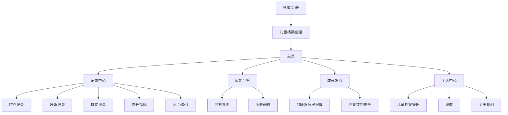
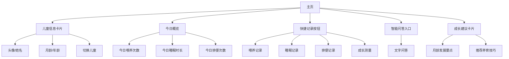
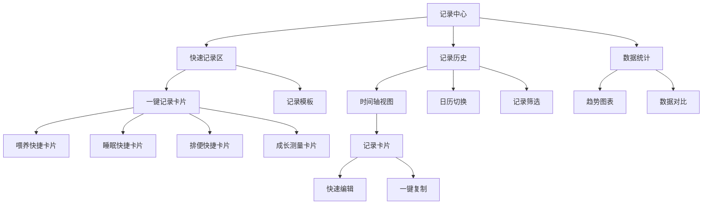
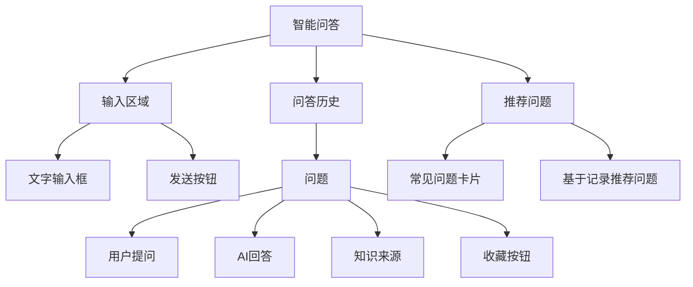
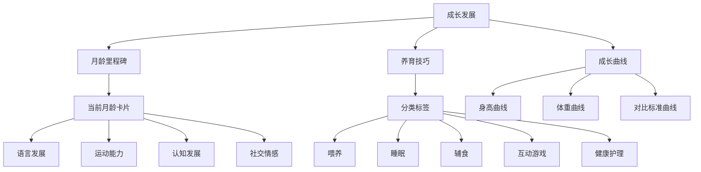
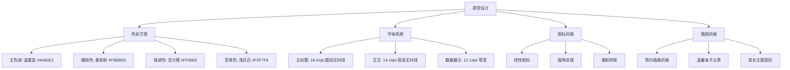
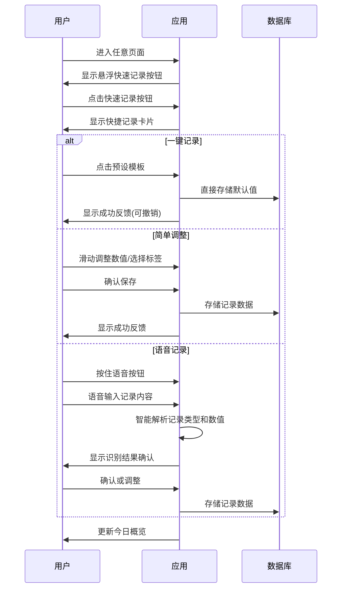
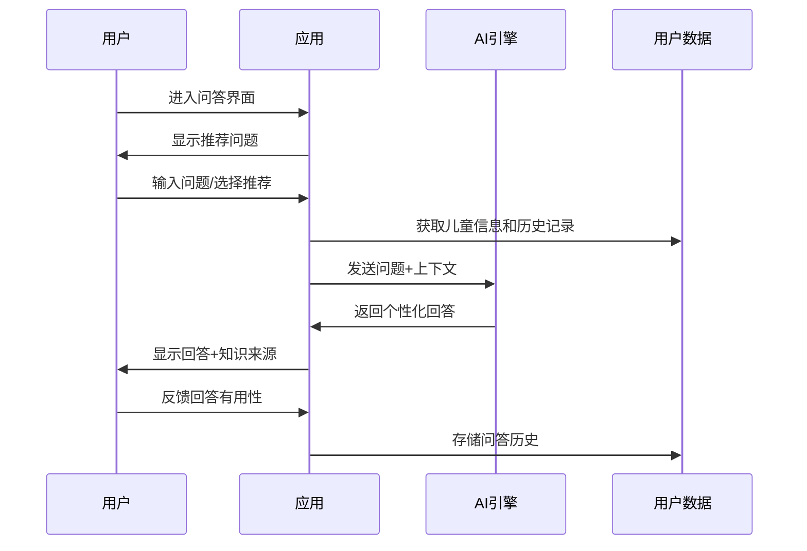
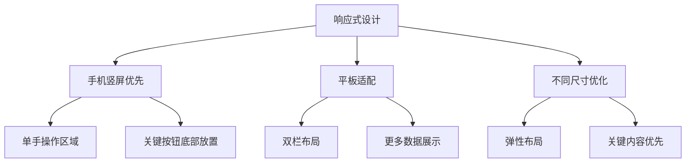

# AI 赋能育儿助手 UI/UX 设计方案

## 页面架构



## 核心页面流程

```mermaid
flowchart LR
    A[启动页] C[注册/登录]
    C --> D[创建儿童档案]
    D --> E[主页]

    subgraph 主要功能流
        E --> F[快速记录]
        E --> G[智能问答]
        E --> H[查看成长建议]
        F --> E
        G --> E
        H --> E
    end
```

## 页面详细设计

### 1. 主页设计



### 2. 记录中心设计（优化版）



### 3. 智能问答设计



### 4. 成长发展设计



## 交互设计原则

1. **极简记录**

   - 减少操作步骤，关键记录功能不超过 1-2 次点击
   - 全局悬浮记录按钮，随时随地可记录
   - 智能默认值和一键式记录，几乎零输入负担
   - 支持语音快速记录，解放双手

2. **情感化设计**

   - 温暖色调为主，减轻育儿焦虑
   - 拟人化反馈，增强亲和力
   - 成就感强化，记录成长里程碑

3. **智能化体验**

   - 基于用户记录智能推荐相关内容
   - 结合宝宝月龄自动调整界面重点
   - 预测用户需求，提供情境化建议

4. **可访问性设计**
   - 支持单手操作，照顾到抱娃情况
   - 夜间模式，适应夜间查看
   - 语音交互优先，解放双手

## 视觉设计风格



## 关键交互流程

### 快速记录流程（优化版）



### 智能问答流程



## 响应式设计考虑



## 总结

本设计方案以用户为中心，特别关注新手父母在照顾婴幼儿时的实际使用场景，聚焦于极简记录体验，通过情感化设计减轻育儿焦虑，同时充分利用 AI 能力提供个性化服务。设计遵循以下核心原则：

1. **极简记录**: 全局一键式操作，几乎零输入负担，支持语音记录
2. **随时随地**: 任何页面都可快速记录，适应单手抱娃场景
3. **智能辅助**: 基于历史数据和时间段的智能默认值
4. **成长陪伴**: 温暖的视觉风格和情感化交互
5. **科学权威**: 清晰展示知识来源和专业建议

通过这套设计，我们旨在打造一款真正能够减轻父母负担、提供科学育儿支持的智能助手应用，特别强调在繁忙育儿过程中的便捷记录体验。
