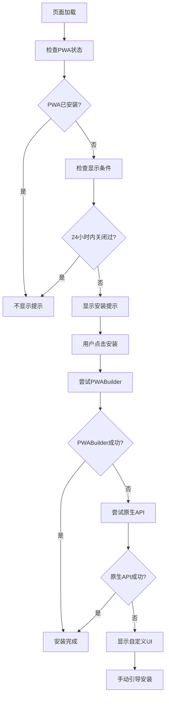

# PWA 安装组件对比说明

## 概述

项目中包含两个 PWA 安装提示组件，各有不同的用途和特点。

## 组件对比

### PWAInstallPrompt（基础版本）

**文件路径：** `src/components/ui/PWAUpdatePrompt.tsx`

**特点：**

- 轻量级实现
- 仅使用原生 `beforeinstallprompt` API
- 简单的 UI 设计
- 支持顶部/底部位置配置
- 主要用于调试和快速实现

**使用场景：**

- 开发环境测试
- 简单的 PWA 安装需求
- 调试 PWA 安装问题

**优势：**

- 代码简单，易于理解
- 包含详细的调试日志
- 轻量级，加载快

**劣势：**

- 功能相对简单
- 依赖浏览器原生支持
- 兼容性有限

### EnhancedPWAInstallPrompt（增强版本）

**文件路径：** `src/components/ui/EnhancedPWAInstallPrompt.tsx`

**特点：**

- 多重安装策略（PWABuilder + 原生 API + 自定义 UI）
- 丰富的用户交互体验
- 网络状态感知
- 智能显示控制（24 小时冷却）
- 专业的 UI 设计

**使用场景：**

- 生产环境
- 需要高兼容性的场景
- 注重用户体验的应用

**优势：**

- 更高的安装成功率
- 跨浏览器兼容性好
- 优雅的降级策略
- 丰富的用户体验
- 智能的显示逻辑

**劣势：**

- 代码复杂度较高
- 依赖外部库（enhancedPWAManager）
- 文件体积稍大

## 技术架构对比

### PWAInstallPrompt 架构

```typescript
interface PWAInstallPromptProps {
  className?: string;
  position?: 'top' | 'bottom';
}

// 功能：
// 1. 监听 beforeinstallprompt 事件
// 2. 显示简单的安装提示
// 3. 处理用户安装选择
// 4. 提供调试日志
```

### EnhancedPWAInstallPrompt 架构

```typescript
interface EnhancedPWAInstallPromptProps {
  className?: string;
  config?: PWAInstallConfig;
  showFallback?: boolean;
  onInstallStart?: () => void;
  onInstallSuccess?: () => void;
  onInstallDismiss?: () => void;
}

// 功能：
// 1. PWABuilder 安装（第一优先级）
// 2. 原生 API 安装（第二优先级）
// 3. 自定义 UI 安装（后备方案）
// 4. 网络状态监听
// 5. 智能显示控制
// 6. 丰富的用户回调
```

## 安装策略对比

### PWAInstallPrompt 安装流程

```mermaid
graph TD
    A[页面加载] --> B[监听beforeinstallprompt]
    B --> C{事件触发?}
    C -->|是| D[显示安装提示]
    C -->|否| E[不显示]
    D --> F[用户点击安装]
    F --> G[调用prompt()]
    G --> H[安装完成]
```

### EnhancedPWAInstallPrompt 安装流程



## 推荐使用方案

### 当前配置（推荐）

在首页使用 `EnhancedPWAInstallPrompt`：

```typescript
// src/pages/home/Home.tsx
<EnhancedPWAInstallPrompt
  showFallback={true}
  onInstallSuccess={() => {
    console.log('🎉 PWA安装成功！');
    // 可以添加用户行为统计
  }}
  onInstallDismiss={() => {
    console.log('📋 用户关闭了安装提示');
    // 可以添加用户行为分析
  }}
/>
```

### 调试环境

保留 `PWAInstallPrompt` 用于开发调试：

```typescript
// 仅在需要调试时使用
import { PWAInstallPrompt } from '@/components/ui/PWAUpdatePrompt';

// 开发环境下的详细调试
if (process.env.NODE_ENV === 'development') {
  return <PWAInstallPrompt position="top" />;
}
```

## 性能影响

### PWAInstallPrompt

- 打包体积：~2KB
- 运行时内存：~50KB
- 初始化时间：<10ms

### EnhancedPWAInstallPrompt

- 打包体积：~8KB
- 运行时内存：~200KB
- 初始化时间：~50ms

## 最佳实践建议

1. **生产环境使用 EnhancedPWAInstallPrompt**

   - 更好的用户体验
   - 更高的安装成功率
   - 更强的兼容性

2. **开发环境保留 PWAInstallPrompt**

   - 用于快速调试
   - 查看详细的 API 调用日志
   - 测试原生 API 行为

3. **根据用户群体选择**

   - 移动端用户较多：使用 EnhancedPWAInstallPrompt
   - 桌面端用户较多：可以使用简单版本
   - 需要支持多种浏览器：必须使用增强版本

4. **性能优化**
   - 懒加载组件
   - 条件性渲染
   - 用户行为统计

## 迁移指南

如果需要从 PWAInstallPrompt 迁移到 EnhancedPWAInstallPrompt：

1. **更新导入**

   ```typescript
   // 旧的
   import { PWAInstallPrompt } from '@/components/ui/PWAUpdatePrompt';

   // 新的
   import { EnhancedPWAInstallPrompt } from '@/components/ui/EnhancedPWAInstallPrompt';
   ```

2. **更新属性**

   ```typescript
   // 旧的
   <PWAInstallPrompt position="top" />

   // 新的
   <EnhancedPWAInstallPrompt
     showFallback={true}
     onInstallSuccess={() => console.log('安装成功')}
   />
   ```

3. **测试兼容性**
   - 在不同浏览器中测试
   - 验证安装流程
   - 检查用户体验

---

_此文档说明了两个 PWA 安装组件的区别和使用场景，帮助开发者选择合适的组件。_
