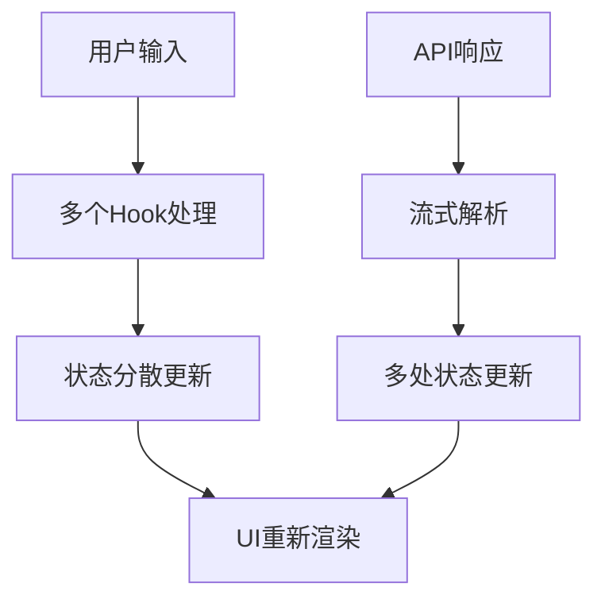
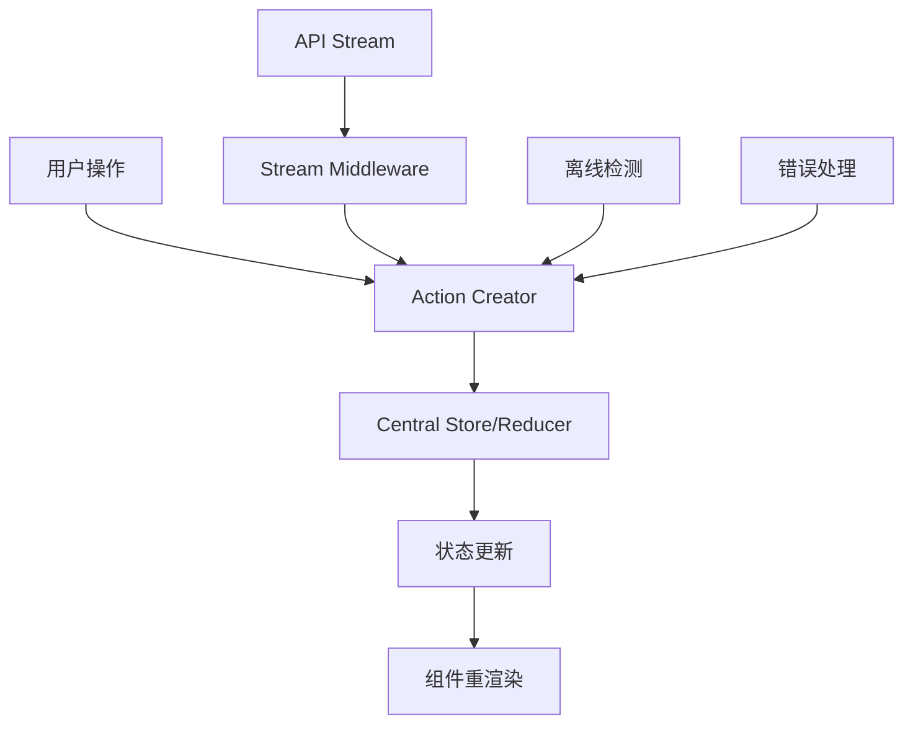

# 🌊 数据流与状态管理优化建议

## 当前数据流问题分析

### 1. 状态分散且缺乏统一管理

```typescript
// 当前状态分散在多个Hook中
useStreamingMessage(); // 流式状态
useMessageListStreaming(); // 消息列表状态
useConversationStore(); // 会话状态
useOfflineSync(); // 离线状态
useMessageStore(); // 消息存储状态
```

**问题**：

- 状态同步困难，容易出现不一致
- 调试复杂，状态变化难以追踪
- 性能问题，过多的状态订阅

### 2. 数据流向不清晰



**问题**：数据流经过多个 Hook，难以追踪和调试

## 优化方案：单向数据流 + 状态机模式

### 1. 建议的新数据流架构



### 2. 状态机驱动的聊天流程

```typescript
// 聊天状态机定义
type ChatState =
  | 'idle' // 空闲状态
  | 'composing' // 正在输入
  | 'sending' // 发送中
  | 'streaming' // 接收流式响应
  | 'completed' // 完成
  | 'error' // 错误状态
  | 'offline'; // 离线状态

type ChatEvent =
  | { type: 'START_TYPING' }
  | { type: 'SEND_MESSAGE'; payload: string }
  | { type: 'STREAM_START' }
  | { type: 'STREAM_CHUNK'; payload: string }
  | { type: 'STREAM_COMPLETE'; payload: string }
  | { type: 'ERROR'; payload: Error }
  | { type: 'GO_OFFLINE' }
  | { type: 'GO_ONLINE' };

// 状态转换函数
const chatStateMachine = (state: ChatState, event: ChatEvent): ChatState => {
  switch (state) {
    case 'idle':
      if (event.type === 'START_TYPING') return 'composing';
      if (event.type === 'GO_OFFLINE') return 'offline';
      break;

    case 'composing':
      if (event.type === 'SEND_MESSAGE') return 'sending';
      break;

    case 'sending':
      if (event.type === 'STREAM_START') return 'streaming';
      if (event.type === 'ERROR') return 'error';
      break;

    case 'streaming':
      if (event.type === 'STREAM_COMPLETE') return 'completed';
      if (event.type === 'ERROR') return 'error';
      break;

    case 'completed':
      if (event.type === 'START_TYPING') return 'composing';
      break;

    case 'error':
      if (event.type === 'START_TYPING') return 'composing';
      break;

    case 'offline':
      if (event.type === 'GO_ONLINE') return 'idle';
      break;
  }
  return state;
};
```

### 3. 中间件模式处理副作用

```typescript
// 流式处理中间件
const streamMiddleware = (store) => (next) => (action) => {
  if (action.type === 'SEND_MESSAGE') {
    // 发送消息并设置流式处理
    sendMessageWithStream(action.payload, (chunk) => {
      store.dispatch({ type: 'STREAM_CHUNK', payload: chunk });
    })
      .then((fullResponse) => {
        store.dispatch({ type: 'STREAM_COMPLETE', payload: fullResponse });
      })
      .catch((error) => {
        store.dispatch({ type: 'ERROR', payload: error });
      });
  }

  return next(action);
};

// 离线中间件
const offlineMiddleware = (store) => (next) => (action) => {
  if (!navigator.onLine && action.type === 'SEND_MESSAGE') {
    // 离线时将消息加入队列
    store.dispatch({ type: 'QUEUE_MESSAGE', payload: action.payload });
    return;
  }

  return next(action);
};

// 持久化中间件
const persistenceMiddleware = (store) => (next) => (action) => {
  const result = next(action);

  // 将重要状态持久化到本地存储
  if (['MESSAGE_ADDED', 'CONVERSATION_CREATED'].includes(action.type)) {
    localStorage.setItem('chatState', JSON.stringify(store.getState()));
  }

  return result;
};
```

### 4. 优化后的 Hook 设计

```typescript
// 统一的聊天Hook，内部使用状态机
export const useChat = (conversationId?: number) => {
  const [state, dispatch] = useReducer(chatReducer, initialState);
  const stateMachine = useStateMachine(chatStateMachine, 'idle');

  // 副作用处理
  useEffect(() => {
    if (stateMachine.state === 'sending') {
      handleSendMessage();
    }
  }, [stateMachine.state]);

  // 统一的消息发送接口
  const sendMessage = useCallback(
    (content: string) => {
      stateMachine.send({ type: 'SEND_MESSAGE', payload: content });
    },
    [stateMachine],
  );

  return {
    // 状态
    chatState: stateMachine.state,
    messages: state.messages,
    isLoading:
      stateMachine.state === 'sending' || stateMachine.state === 'streaming',
    error: state.error,

    // 操作
    sendMessage,
    startTyping: () => stateMachine.send({ type: 'START_TYPING' }),
    clearError: () => dispatch({ type: 'CLEAR_ERROR' }),
  };
};
```

## 性能优化建议

### 1. 细粒度状态订阅

```typescript
// ❌ 错误：订阅整个状态
const ChatComponent = () => {
  const chatState = useChatState(); // 任何状态变化都会重渲染

  return <div>{chatState.messages.length}</div>;
};

// ✅ 正确：只订阅需要的状态
const MessageCount = () => {
  const messageCount = useChatSelector((state) => state.messages.length);

  return <div>{messageCount}</div>;
};
```

### 2. 消息虚拟化

```typescript
// 对于大量消息，使用虚拟滚动
const VirtualMessageList = () => {
  const messages = useChatSelector((state) => state.messages);

  return (
    <VirtualList
      items={messages}
      itemHeight={80}
      renderItem={({ item, index }) => (
        <MessageItem key={item.id} message={item} />
      )}
    />
  );
};
```

### 3. 智能缓存策略

```typescript
// 消息内容缓存
const useMessageCache = () => {
  const cache = useRef(new Map());

  const getFormattedMessage = useCallback((message) => {
    if (cache.current.has(message.id)) {
      return cache.current.get(message.id);
    }

    const formatted = formatMessage(message);
    cache.current.set(message.id, formatted);
    return formatted;
  }, []);

  return { getFormattedMessage };
};
```

## 错误处理与边界情况

### 1. 错误边界组件

```typescript
class ChatErrorBoundary extends React.Component {
  constructor(props) {
    super(props);
    this.state = { hasError: false };
  }

  static getDerivedStateFromError(error) {
    return { hasError: true };
  }

  componentDidCatch(error, errorInfo) {
    console.error('聊天组件错误:', error, errorInfo);
    // 发送错误到监控系统
  }

  render() {
    if (this.state.hasError) {
      return (
        <ChatErrorFallback onRetry={() => this.setState({ hasError: false })} />
      );
    }

    return this.props.children;
  }
}
```

### 2. 网络重连机制

```typescript
const useNetworkReconnection = () => {
  const dispatch = useChatDispatch();

  useEffect(() => {
    const handleOnline = () => {
      dispatch({ type: 'GO_ONLINE' });
      // 重新发送队列中的消息
      dispatch({ type: 'RETRY_QUEUED_MESSAGES' });
    };

    const handleOffline = () => {
      dispatch({ type: 'GO_OFFLINE' });
    };

    window.addEventListener('online', handleOnline);
    window.addEventListener('offline', handleOffline);

    return () => {
      window.removeEventListener('online', handleOnline);
      window.removeEventListener('offline', handleOffline);
    };
  }, [dispatch]);
};
```

## 实施路线图

### 阶段 1：状态统一（1-2 周）

1. 创建统一的状态管理 store
2. 迁移现有的分散状态
3. 建立标准的 Action 和 Reducer

### 阶段 2：数据流优化（1-2 周）

1. 实现中间件系统
2. 添加状态机逻辑
3. 优化性能瓶颈

### 阶段 3：错误处理完善（1 周）

1. 添加错误边界
2. 完善离线处理
3. 网络重连机制

### 阶段 4：性能优化（1 周）

1. 消息虚拟化
2. 智能缓存
3. 细粒度订阅优化

## 预期收益

- **开发效率提升 30%**：清晰的数据流和状态管理
- **Bug 减少 50%**：状态机防止非法状态转换
- **性能提升 40%**：精确的状态订阅和虚拟化
- **用户体验改善**：更好的错误处理和离线支持
